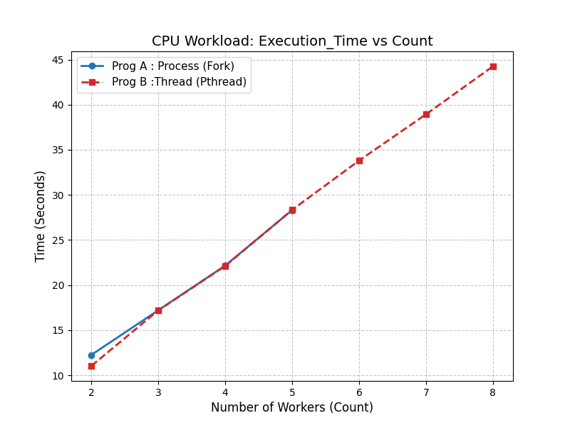
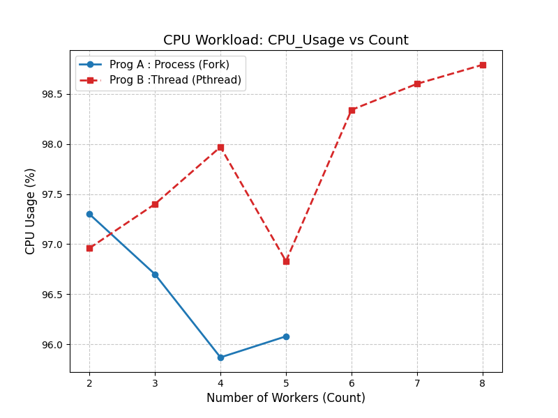
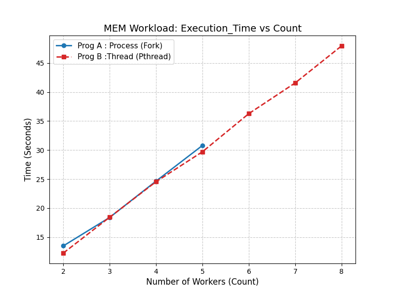
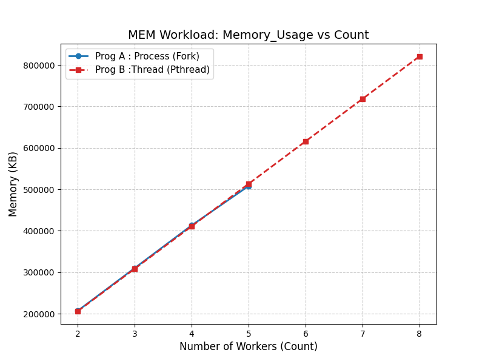
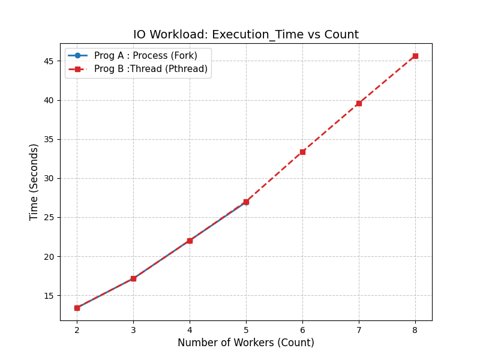
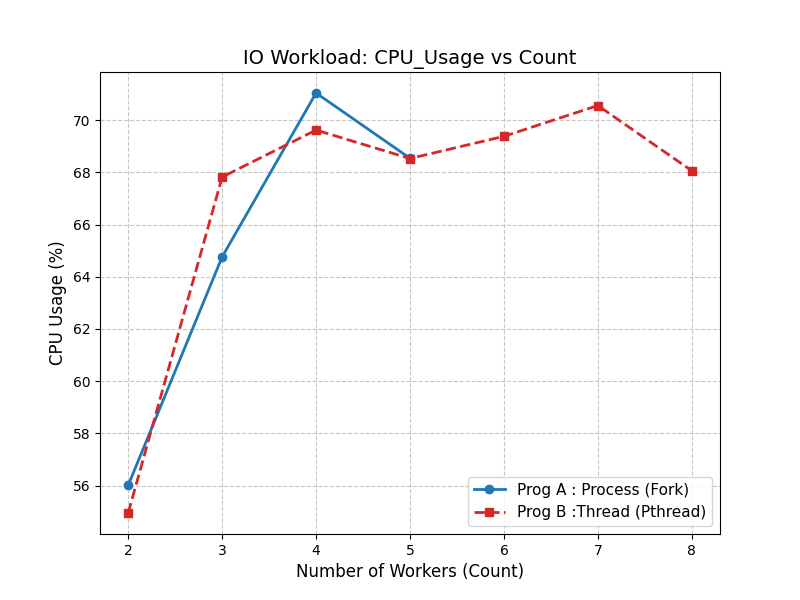

# Graduate Systems CSE638 Assignment PA01
## Arya Singh - MT25019
**Performance analysis: processes vs threads**

## Project Overview
This project benchmarks and compares the performance characteristics of processes (created via `fork()`) and POSIX threads (created via `pthread_create()`). The goal is to analyze the overhead of context switching, memory management, and I/O contention under different workloads.

## Project Structure

### Source Code
* **`MT25019_Part_A_Program_A.c`**: The Process-based implementation. It accepts arguments for the worker type and count, creating `N` child processes that execute parallel tasks.
* **`MT25019_Part_A_Program_B.c`**: The Thread-based implementation. It creates `N` threads within a single process to execute the same tasks sharing the same address space.
* **`MT25019_Part_B_worker.h`**: A shared header library containing the workload logic:
    * `cpu()`: Performs complex floating-point arithmetic (Sine/Cosine/Sqrt) to saturate the ALU.
    * `mem()`: Allocates 100MB per worker and performs continuous write operations with a stride pattern.
    * `io()`: Uses `fprintf()` in nested loops to generate text output, immediately followed by `fsync()` to force physical blocking I/O and stress disk synchronization.

### Automation & Scripts
* **`Makefile`**: Automates compilation (flags: `-pthread -lm`).
* **`MT25019_Part_D_runner.sh`**: The main automation script. It is built upon the automation in Part C (`MT25019_Part_C_runner.sh`), which now iterates through worker counts (2-8), pins execution to **CPU 0**, and captures metrics (Time, CPU%, Mem, I/O) using `top`, `ps`, `iostat` and `taskset` commands, into a CSV (`MT25019_Part_D_CSV.csv`).
* **`MT25019_Part_D_plotter.py`**: Python script using matplotlib to generate the performance graphs from the CSV data.
---

## Build & Run Instructions

### 1. Prerequisites
* Linux Environment (or Docker container)
* GCC Compiler
* Make
* Python 3 with pandas and matplotlib (for plotting)

### 2. Compilation
To compile both `program_a` and `program_b`, simply run:
```bash
make
```
To remove compiled binaries:
```bash
make clean
```

### 3. Running the Automation
To make all binaries, generate the dataset and run the full experiment:
```bash
chmod +x MT25019_Part_D_runner.sh
./MT25019_Part_D_runner.sh
```
*This will run the experiments pinned to Core 0 and save results to `MT25019_Part_D_CSV.csv`.*

---

## Resulting Plots

Below are the performance metrics collected from the experiments.

### 1. CPU Intensive Workload
*Observation: Execution time increases linearly as workers share the single CPU core (Time Slicing).*

| Execution Time | Resource Usage |
|:---:|:---:|
|  |  |

### 2. Memory Intensive Workload
*Observation: Memory usage scales linearly (~100MB per worker) for both threads and processes.*

| Execution Time | Memory Scaling |
|:---:|:---:|
|  |  |

### 3. I/O Intensive Workload
*Observation: CPU Usage drops significantly (Blocking Effect) as threads wait for disk I/O.*

| Execution Time | CPU Usage (Blocking) |
|:---:|:---:|
|  |  |

---

## AI Declaration
I utilized generative AI (Gemini) during this assignment to assist with generating boilerplate code, deebugging C syntax errors regarding pthread arguments, writing bash scripts to automate the data collection using `top` and `iostat`. All analysis, and final code implementation were verified and executed by myself.
