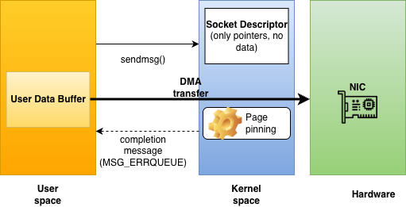
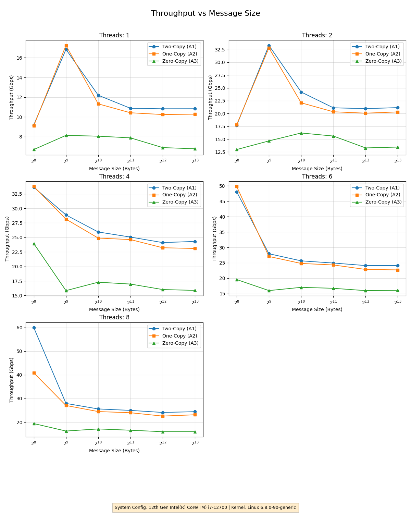
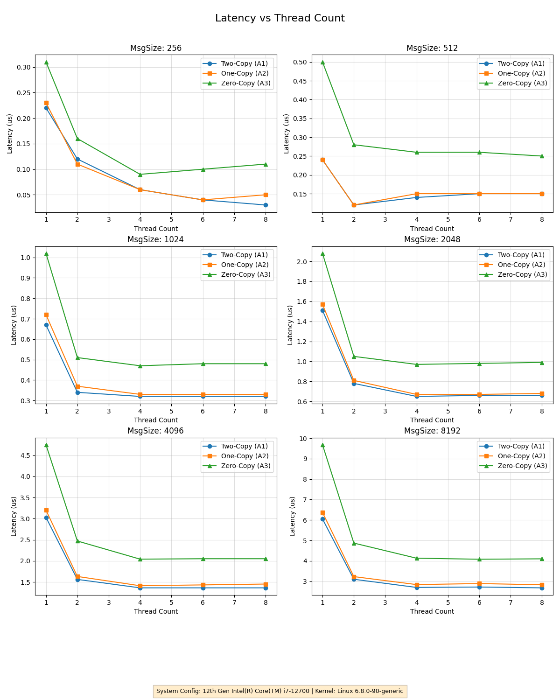
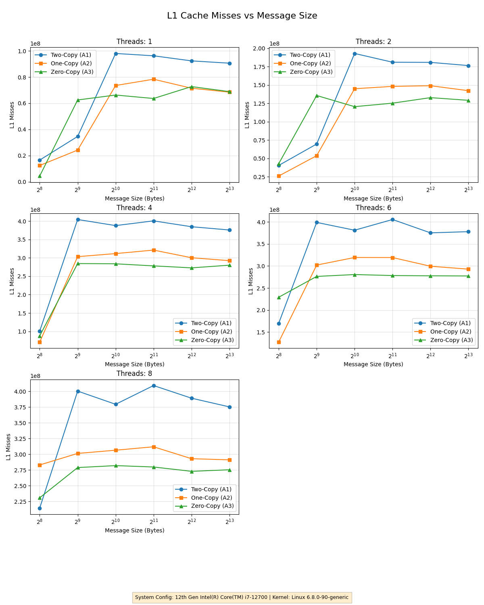
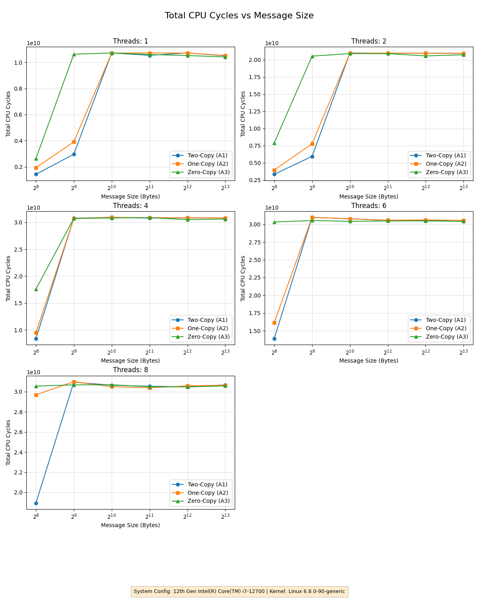

# Graduate Systems CSE638 Assignment PA02
## Arya Singh - MT25019
**Performance analysis: Network I/O**

## Project Overview
This project evaluates the performance of three different network data transfer strategies in the Linux kernel. By benchmarking throughput, latency, and CPU cache behavior, we identify the overheads associated with data copying and the trade-offs of using Zero-Copy mechanisms.

---

## Project File Structure

The repository consists of the following components:

* **MT25019_Part_A_common.h**: Shared header file defining constants, message structures, and operation modes.
* **MT25019_Part_A_server.c**: The server-side implementation containing the logic for Two-Copy, One-Copy, and Zero-Copy modes.
* **MT25019_Part_A_client.c**: A multi-threaded client tool that measures application-level throughput (Gbps) and latency.
* **Makefile**: Automates the compilation of the server and client binaries.
* **MT25019_Parts_B_C_run_experiment.sh**: Automation script that sets up network namespaces and collects telemetry via `perf stat`.
* **MT25019_Part_C_results.csv**: The raw dataset containing performance metrics for 90 different test cases.
* **MT25019_Part_D_plot.py**: Python script used to visualize the collected data.

---

## Workflow
When we run ```MT25019_Parts_B_C_run_experiment.sh```, this script:
- collects app level metrics (throughput, latency)
- collects CPU cycles, L1/LLC cache misses, context switches from perf command
- collects all of these metrics for every combination of threads and message size
- plots the relevant plots using ```MT25019_Part_D_plot.py``` file.

---

## Experimental Analysis & Visualizations

### Zerocopy working
<figure>

<figcaption> Kernel diagram for zero copy</figcaption>
</figure>

The following plots are critical for interpreting the system performance:

### 1. Throughput & Latency

<figure>

<figcaption> Throughput vs Message Size Comparison </figcaption>
</figure>

* **Throughput Analysis**: **Two-Copy (Mode 1)** often achieves higher throughput for smaller messages because the cost of copying is lower than the overhead of Zero-Copy page management.

<figure>

<figcaption> Latency vs Thread Count Comparison </figcaption>
</figure>

* **Latency Analysis**: **Zero-Copy (Mode 3)** introduces higher latency at smaller message sizes due to the overhead of processing completion notifications via the error queue.

---

### 2. Cache & CPU Efficiency

<figure>

<figcaption> L1 Data Cache Misses Comparison </figcaption>
</figure>

* **L1 Cache Performance**: **One-Copy (Mode 2)** and **Zero-Copy (Mode 3)** significantly reduce L1 Data Cache misses by avoiding the redundant user-space serialization step required in Mode 1.

<figure>

<figcaption> Total CPU Cycles vs Message Size </figcaption>
</figure>

* **Computational Efficiency**: This plot compares total CPU cycles to determine the computational efficiency of each mode as message sizes scale, illustrating the "Cycles Per Byte" trade-off[cite: 2].

---
## Build instructions

### Run experiment
Execute the experiment script (requires sudo for network namespaces and perf counters):
```bash
chmod +x ./*.sh
sudo ./MT25019_Parts_B_C_run_experiment.sh
```

### Generate Plots
Visualize the results stored in the CSV file:
```bash
python3 MT25019_Part_D_plot.py
```

---

## Summary of Findings
* **Zero-Copy Overhead**: Mode 3 is not always the fastest; it requires larger message sizes to offset the cost of page pinning and notification handling.
* **Cache Contention**: Increasing thread counts leads to a spike in L1 and LLC misses as threads compete for shared cache resources on a limited number of cores.
* **One-Copy Performance**: Mode 2 (Scatter-Gather) provides a middle ground, offering high throughput for small-to-medium messages without the heavy pinning overhead of Mode 3.